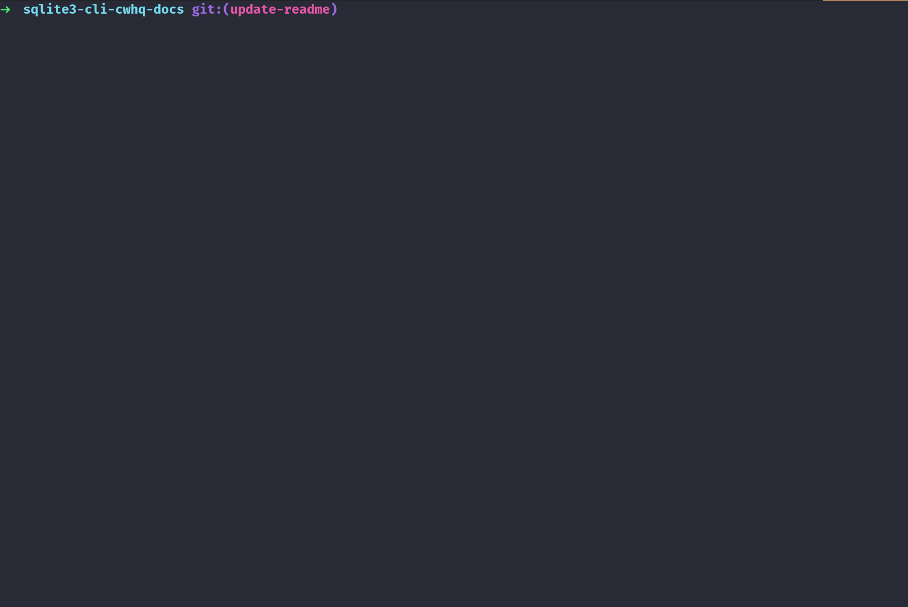

# CWHQ SQLite3 CLI

The CWHQ SQLite3 CLI implements a small subset of the [sqlite3 CLI](https://www.sqlite.org/cli.html). It's intended to be used by students at CodeWizardsHQ to practice their SQL skills.

## Installation

Clone the repo to your machine and install the packages from `requirements.txt`.

```bash
# Clone the repo
git clone git@github.com:daniel-schroeder-dev/cwhq-sqlite3-cli.git

# Enter the directory of the repo
cd cwhq-sqlite3-cli

# Install the required packages
python -m pip install -r requirements.txt
```

## Usage

The `main.py` file contains the CLI. Run that using your `python` interpreter:

```bash
python main.py
```

There are 4 commands available:


| Command              | Description                                          |
| -------------------- | ---------------------------------------------------- |
| .exit                | Exits this app                                       |
| .tables              | Displays the tables in the DB                        |
| .schema [table_name] | Displays the `CREATE TABLE` statement for this table |
| .help                | Displays these options                               |

## Pre-Populated Tables

The CLI comes pre-populated with a few tables:

```text
sqlite> .tables


authors
books
products
teachers
users
```

Here are the schemas of each:

```text
sqlite> .schema authors

CREATE TABLE authors (
    author_id INTEGER PRIMARY KEY AUTOINCREMENT,
    author_name TEXT NOT NULL
)

sqlite> .schema books

CREATE TABLE books (
    book_id INTEGER PRIMARY KEY AUTOINCREMENT,
    author_id INTEGER NOT NULL REFERENCES authors (author_id),
    book_title TEXT UNIQUE NOT NULL
)

sqlite> .schema products

CREATE TABLE products (
    product_id INTEGER PRIMARY KEY AUTOINCREMENT,
    product_name TEXT UNIQUE NOT NULL,
    product_price REAL NOT NULL,
    product_category TEXT NOT NULL
)

sqlite> .schema teachers

CREATE TABLE teachers (
    teacher_id INTEGER PRIMARY KEY AUTOINCREMENT,
    user_id INTEGER NOT NULL REFERENCES users (user_id),
    username TEXT,
    password TEXT,
    is_admin INTEGER NOT NULL
)

sqlite> .schema users

CREATE TABLE users (
    user_id INTEGER PRIMARY KEY AUTOINCREMENT,
    username TEXT UNIQUE NOT NULL,
    password TEXT NOT NULL
)
```

## Database Persistence

The app creates new DBs for each session and old DBs are wiped out. So, no data you write will exist after exiting the app. 

You can execute any valid SQLite3 command against the DB and it should work. If you find a query that doesn't work, please file an issue [here](https://github.com/daniel-schroeder-dev/cwhq-sqlite3-cli/issues). 


## Example Session

Here's a short example session:




## Contributing
Pull requests are welcome. For major changes, please open an issue first to discuss what you would like to change.

## License
[MIT](https://choosealicense.com/licenses/mit/)